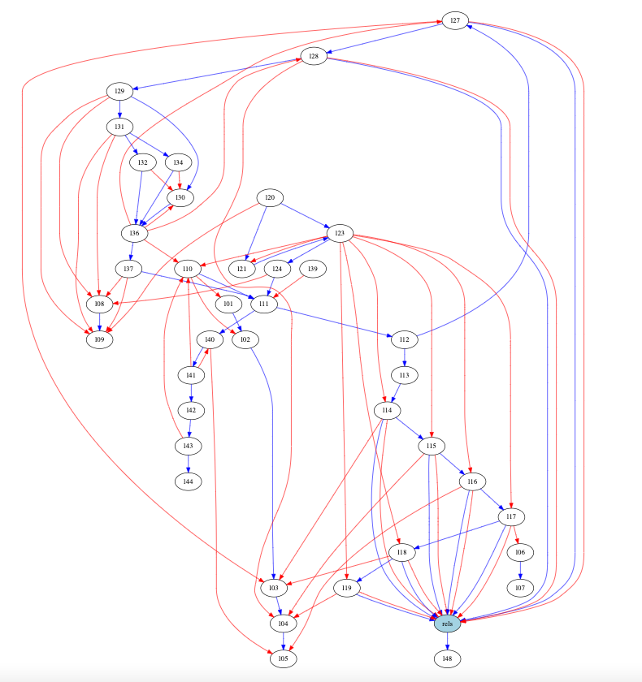
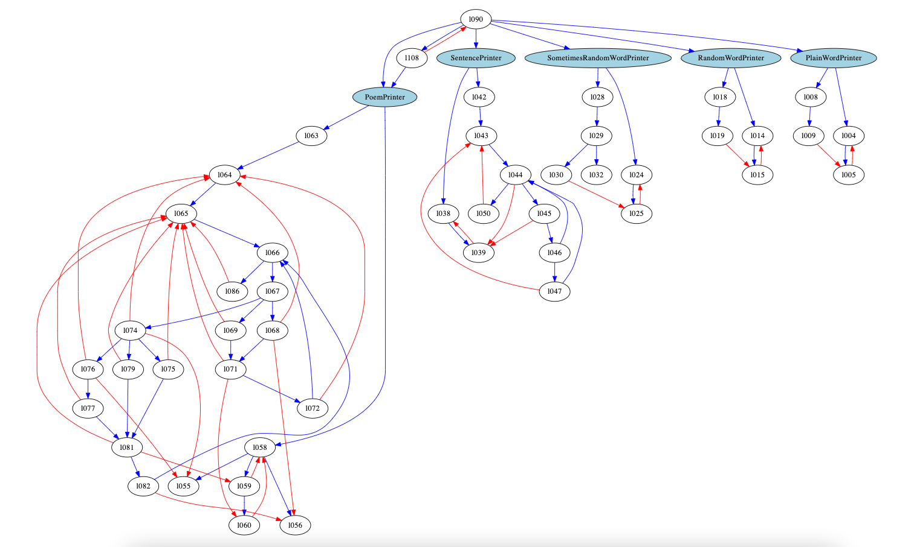

# Object-Oriented Programming in JavaScript

### Quickstart
1. Clone this repository to your local machine
```sh
$ git clone git@github.com:boolean-uk/oop-js.git && cd oop-js
```
2. Fetch and merge recent changes
```sh
$ git pull origin main
```

### Introduction

#### Procedural Architecture
This is a graph of the way lines of code interact in a procedural program.

Each node is a line number. The tendrils are roughly what a developer’s brain needs to keep track of when programming. What’s in all the variables (red) and where the program is going next (blue).




Fairly obviously, it’s super hard to keep all these interactions in your head. Even worse — any developer could come in and add a tendril connecting any of the nodes to each other, meaning that bits of the code were dependent on each other.

So when that bit needed to change, many other things would break and programmers would spend ages tracing everything back and fixing the connections.

So the question therefore becomes how to design the program better to limit this complexity.

#### Object Oriented Architecture



This is the diagram after converting the program to an Object Oriented approach. The classes are highlighted in blue.

Notice the clustering. While there is still a big messy chunk, it is all ‘behind’ (or ‘within’) the PoemPrinter class.

In fact, many OO (Object Oriented) languages are written so that it is impossible for any of the other nodes to connect with anything except by going through PoemPrinter. It acts as a gatekeeper to all the code and state inside it.

You will discover that this has many benefits.

For now, remember how we’ve gone from one big messy network to a number of smaller and distinct networks.

### Concepts
Many of these concepts are not solely the domain of OOP. In fact, in this list only Inheritance and Polymorphism arguably are OOP-only features.
- [Encapsulation](./encapsulation)
- [Cohesion](./cohesion)
- [Coupling](./coupling)
- [Abstraction]()
- [Inheritance]()
- [Polymorphism]()

#### Resources

- [ ] [What is an Object?](https://docs.oracle.com/javase/tutorial/java/concepts/object.html)
